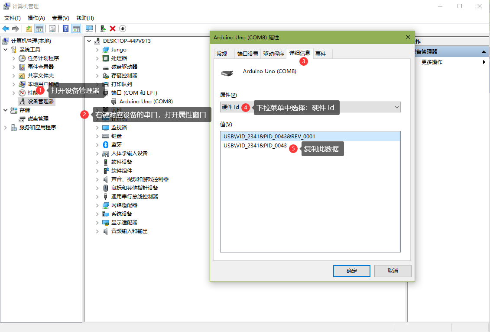

## 基础控制板 deviceId

```js
[
    'arduinoUno',
    'arduinoUnoUltra', // 定制化 uno 包含 A6, A7 引脚
    'arduinoNano',
    'arduinoMini',
    'arduinoLeonardo',
    'arduinoMega2560',
    'arduinoEsp32',
    'microbit',
    'microbitV2'
]
```

## 硬件id

### 常见硬件 id

```js
[
    // CH340
    'USB\\VID_1A86&PID_7523',
    // PL2303
    'USB\\VID_067B&PID_2303',
    // FT232
    'USB\\VID_0403&PID_6001',
    // CP2102
    'USB\\VID_10C4&PID_EA60',
    // Arduino Uno
    'USB\\VID_2341&PID_0043',
    'USB\\VID_2341&PID_0001',
    'USB\\VID_2A03&PID_0043',
    'USB\\VID_2341&PID_0243',
    // Arduino Maga 2560
    'USB\\VID_2341&PID_0010',
    'USB\\VID_2341&PID_0042',
    'USB\\VID_2A03&PID_0010',
    'USB\\VID_2A03&PID_0042',
    'USB\\VID_2341&PID_0210',
    'USB\\VID_2341&PID_0242',
    // Arduino Leonardo
    'USB\\VID_2341&PID_0036',
    'USB\\VID_2341&PID_8036',
    'USB\\VID_2A03&PID_0036',
    'USB\\VID_2A03&PID_8036',
    // Microbit
    'USB\\VID_0D28&PID_0204',
]
```

###  查询设备的硬件ID

如果你使用的是其他型号的USB转TTL芯片，或是USB协议实现的CDCACM串口，且不知道其 VID/PID 数值，可在设备管理器 -> 端口 -> 对应设备右键属性 -> 详细信息 -> 设备 Id 中查询。


