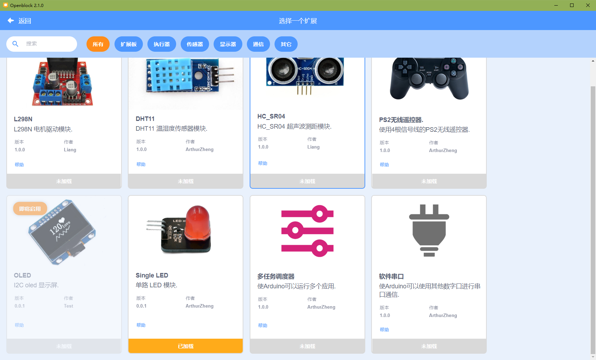

## 介绍

为 OpenBlock 开发插件的方式主要有2种：

1. 安装 OpenBlock Desktop 或 OpenBlock Link，在缓存目录下添加并调试插件。
2. 安装 Node.js 开发环境，克隆 openblock-resource 软件包并运行，而后在临时生成的缓存目录下添加并调试插件。（此方法可大幅度提高调试效率。）

=== "方法1"

    1. 下载并安装 OpenBlock Desktop 或 OpenBlock Link。
    2. 开启软件 OpenBlock Desktop 或 OpenBlock Link 以在用户路径下生成缓存目录，而后关闭软件。
    3. 根据系统及所装软件打开以下路径（注意将 <user name> 替换为你的用户名）：

        ```js
        // OpenBlock Desktop - Windows
        "C:\Users\<user name>\AppData\Roaming\OpenBlock Desktop\Data\external-resources"
        // OpenBlock Desktop - Mac
        待补充
        // OpenBlock Desktop - Linux
        待补充

        // OpenBlock Link - Windows
        "C:\Users\<user name>\AppData\Roaming\Openblock Link\Data\external-resources\extensions"
        // OpenBlock Link - Mac
        待补充
        // OpenBlock Link - Linux
        待补充
        ```

=== "方法2"

    1. 搭建开发环境

        请确保你的计算机已经安装好以下软件或工具：
        
        - Node.js > 8

        - git

    2. 运行下述指令克隆 openblock-resource 代码，安装依赖。

        ```bash
        git clone https://github.com/openblockcc/openblock-resource.git
        cd openblock-resource
        npm i
        npm run fetch
        ```

    3. 而后打开 openblock-resource 存放的路径，在目录下找到并打开文件夹 `external-resources`

编辑器方面，推荐使用 VS Code.

## 开发一个简单的 LED 模块插件

下面以开发一个适用于 Arduino 的 LED 模块插件作为入门例程。

进入 `external-resources/extensions/arduino/sensor` 目录复制 `dht` 文件夹到 `arduino/display`，并重命名为 `singleLED` 我们将在此基础上修改为新的 LED 模块插件。操作完成后的目录结构应该如下所示：


### 修改 index.js 内容

index文件描述了插件的基本信息，包含插件的名称等在GUI上显示和交互的内容。原始的文件内容如下：

```js
const dht = formatMessage => ({
    name: formatMessage({
        id: 'dht.name',
        default: 'DHT Sensor'
    }),
    extensionId: 'dht',
    version: '1.0.0',
    supportDevice: ['arduinoUno', 'arduinoNano', 'arduinoLeonardo',
        'arduinoMega2560', 'arduinoEsp32', 'arduinoEsp8266'],
    author: 'ArthurZheng',
    iconURL: `asset/dht.png`,
    description: formatMessage({
        id: 'dht.description',
        default: 'DHT Temperature and humidity sensor module.'
    }),
    featured: true,
    blocks: 'blocks.js',
    generator: 'generator.js',
    toolbox: 'toolbox.js',
    msg: 'msg.js',
    library: 'lib',
    official: true,
    tags: ['sensor'],
    helpLink: 'https://wiki.openblock.cc'
});

module.exports = dht;

```

1. 首先替换首位定义并导出的变量名从 dht 为 singleLED。

2. 修改 Name 为 Single LED，此属性为在插件界面显示的插件名称。

3. 修改 ExtensionId 为 singleLED，注意此ID需要保证唯一性，不可与 Arduino 目录下其他的扩展 ID 重复。

4. 修改 Version 版本为 V0.0.1，此属性为在插件界面显示，用于管理跟踪与查询此插件的内容更新。

5. author 修改为你的名字。

6. 保存下方图片至 `arduino/display/singleLED/asset/singleLED.png`，并修改 iconURL 为 `asset/singleLED.png`，此图片为插件封面图。

    

7. 修改 description 为

    ```js
    formatMessage({
        id: 'arduino.singleLED.description',
        default: 'Single led module.',
        description: 'Description of singleLED'
    }),
    ```

    此属性为插件介绍，在插件图片下方显示。

8. 修改 tags 为 `display`，插件界面中用户选择 display 标签过滤内容时，此插件将会显示。

9. 删除 lib 属性以及 lib 文件夹，因为此插件不需要使用第三方的 Arduino 库。

修改后的文件内容如下：

```js
const singleLED = formatMessage => ({
    name: 'Single LED',
    extensionId: 'singleLED',
    version: '0.0.1',
    supportDevice: ['arduinoUno', 'arduinoNano', 'arduinoLeonardo', 'arduinoMega2560'],
    author: 'ArthurZheng',
    iconURL: `asset/singleLED.png`,
    description: formatMessage({
        id: 'singleLED.description',
        default: 'Single led module.',
        description: 'Description of single LED'
    }),
    featured: true,
    blocks: 'blocks.js',
    generator: 'generator.js',
    toolbox: 'toolbox.js',
    msg: 'msg.js',
    official: true,
    tags: ['display'],
    helpLink: 'https://wiki.openblock.cc'
});

module.exports = singleLED;
```

### 修改 *-locales.json

`external-resources/official-locales.json` 这个文件中保存了由官方维护的设备和插件 index 文件中 description 的本地化翻译内容，在 openblock 开发过程中这个文件是由工作流自动提取到 transifex 翻译平台由维护者翻译后，再由工作流自动生成的。

`external-resources/third-party-locales.json` 则是用来存放第三方内容，此部分需要手动修改，不会由自动化工作流处理。
单以上两个文件的实际功能是相同的，软件在实际调用是会合并这些内容，下面的内容添加在哪个文件中都可以。

```json
{
    "en": {
        "singleLED.description": "Single led module."
        ...
    },
    "zh-cn": {
        "singleLED.description": "单 led 模块。"
        ...
    },
    "zh-tw": {
        "singleLED.description": "單 led 模塊。"
        ...
    }
}
```

### 修改积木结构，语言生成器，工具箱列表及翻译文件内容

下面我们依次修改 blocks.js，generator.js，toolbox.js 及 msg.js 文件，他们分别为积木结构文件，语言生成器文件，工具箱列表文件以及翻译文件。不过在开始修改之前，我们还需要提前规划好我们要设计的插件的积木样式及内容。

在这个例程中，我们只为此插件编写一个积木块，控制LED的开关状态，其内容与效果如下图所示。


#### blocks.js

```js
function addBlocks (Blockly) {
    const color = '#FF0000';

    Blockly.Blocks.singleLED_setLEDState = {
        init: function () {
            this.jsonInit({
                message0: Blockly.Msg.SINGLELED_SET_LED_STATE,
                args0: [
                    {
                        type: 'input_value',
                        name: 'pin'
                    },
                    {
                        type: 'field_dropdown',
                        name: 'state',
                        options: [
                            [Blockly.Msg.SINGLELED_ON, '1'],
                            [Blockly.Msg.SINGLELED_OFF, '0']]
                    }
                ],
                colour: color,
                extensions: ['shape_statement']
            });
        }
    };

    return Blockly;
}

exports = addBlocks;

```

这个文件中定义了上图中积木的样式，由json格式的数据生成 svg 元素的积木块。其中实际显示的内容为 Blockly.Msg.XXX，这个变量是在 msg.js 中定义的，需要对照来看。

#### generator.js

```js
function addGenerator (Blockly) {
    Blockly.Arduino.singleLED_setLEDState = function (block) {
        const pin = Blockly.Arduino.valueToCode(block, 'pin', Blockly.Arduino.ORDER_ATOMIC);
        const state = this.getFieldValue('state');

        return `digitalWrite(${pin}, ${state})\n`;
    };

    return Blockly;
}

exports = addGenerator;
```

这个文件中定义了 blocks.js 中对应积木的代码生成函数，在这个函数中获取了 pin 和 state 中的内容，并生成返回了对应的 arduino 代码。

#### toolbox.js

```js
function addToolbox () {
    return `
<category name="%{BKY_SINGLELED_CATEGORY}" id="SINGLELED_CATEGORY" colour="#FF0000" secondaryColour="#FF0000">
    <block type="singleLED_setLEDState" id="singleLED_setLEDState">
        <value name="pin">
            <shadow type="math_number">
                <field name="NUM">2</field>
            </shadow>
        </value>
    </block>
</category>`;
}

exports = addToolbox;
```

这个文件定义了积木在工具栏中的名称样式 及输入框中的默认内容与数据类型。其中 `%{BKY_SINGLELED_CATEGORY}` 的实际内容也在 msg.js 中定义，不过注意在赋值时需要去掉 `BKY_`前缀。

#### msg.js

```js
function addMsg (Blockly) {
    Object.assign(Blockly.ScratchMsgs.locales.en, {
        SINGLELED_CATEGORY: 'single LED',
        SINGLELED_SET_LED_STATE: 'set pin %1 LED %2',
        SINGLELED_ON: 'on',
        SINGLELED_OFF: 'off'
    });
    Object.assign(Blockly.ScratchMsgs.locales['zh-cn'], {
        SINGLELED_CATEGORY: '单路LED',
        SINGLELED_SET_LED_STATE: '设置引脚 %1 LED 为 %2',
        SINGLELED_ON: '开',
        SINGLELED_OFF: '关'
    });
    return Blockly;
}

exports = addMsg;
```
这个文件用于实现本地化翻译内容，定义了上面几个文件中变量的实际内容。

### 关闭校验和验证

修改 `external-resources/config.json` 文件内容，删除属性 `"sha256": "xxx"`。

### 验证插件功能

而后根据之前搭建开发环境的方式的不同，选择以下操作：

=== "方法1"

    1. 直接开启 OpenBlock 桌面版

=== "方法2"

    1. 在 openblock-resource 目录下执行指令启动本地资源服务器

        ```bash
        npm run start
        ```

    3. 而后开启 OpenBlock 桌面版。

而后我们选择 Arduino Uno 控制板，切换到上传模式下，点击插件选择按钮，选择我们刚刚做好的插件。



在工作区组装一个程序，调用插件的积木块。


随便修改以下引脚和状态选项，发现生成的代码正确。这样一个简单的插件就编写完成了。

!!! Tip
    使用 openblock-resource 方法时，再启动后会模拟桌面版首次启动的过程，将路径下的 external-resources 复制到上级目录的 `.openblockData` 文件夹中，且每次启动都会自动清除这个目录的内容并重新复制，在插件体积较大时该过程耗时较长，建议将 `package.json` 文件 L8 行中的 `"start": "rimraf ../.openblockData/external-resources && node ./test/start.js",` 改为 `"start": "node ./test/start.js",` 以关闭自动清除指令，如果在之后的修改中删除了某些文件时，可以手动清除目录中的缓存以删除不再使用的文件。

!!! Tip
    在服务器启动后，缓存目录下的文件只有 `index.js`， `*-locales.json`，`config.json` 文件会被直接读取，在修改这仨个文件后必须重启软件或指令服务器才可生效。但其他如：`blocks.js` 等文件在修改后可以在软件界面中重新加载就可生效，而不需要重启，这样可以加快调试速度和流程。

## 贡献代码

在完成插件的调试后，此时我们的插件仍处于独立的工程或缓存内的临时路径，在清除缓存或关闭 openblock-resource 服务器后就会恢复原样。此时我们可以将调试好的插件移动至软件安装路径下的文件夹中 `OpenBlock\resources\external-resources\extensions`，软件在首次运行或清除缓存后会从此处拷贝文件到缓存下使用，并将 `OpenBlock\resources\external-resources\config.json` 中的 repository 值改为空。否则如果远程服务器的资源如果更新了，更新后的文件就会覆盖缓存内容，导致在安装目录下添加的插件没有显示。但这样会导致插件升级功能失效，无法再从服务器获取新的内容。

```json
{"repository":"","version":"v1.0.1"}
```

如果你希望获得服务器的更新，并且希望自己编写的插件能够被更多的人使用，你可以在github上提交自己的插件代码，经过社区审核后。社区会定期整理发布新的更新包，这样你提交的代码就会在下一次的更新中出现了。

社区插件及设备的外部资源仓库地址为：[https://github.com/openblockcc/external-resources](https://github.com/openblockcc/external-resources)。

fork 修改并 push 后再提交 pr 即可。
