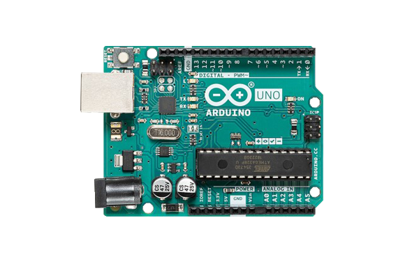
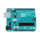

## 简介

在 OpenBlock 中控制板就是在指控制板如：Arduino UNO、Arduino Nano等，或是由这些控制板衍生的第三方主板。

为了添加新的设备我们将需要完成以下操作:

1. [在openblock-gui添加设备图片和配置](#openblock-gui)
2. [在openblock-vm中添加设备代码](#openblock-vm)
3. [在openblock-blocks中添加代码转译函数](#openblock-blocks)

## openblock-gui 添加设备图片和配置

1. 根据以下参数与示例图片制作控制板的图片，请确保在周围留有合适宽度的白色边缘，以保证风格统一， 这个图片将用于显示在设备选择界面中。

    **格式**：png

    **分辨率**：600x372

    **背景色**：白色

    你可以直接保存下面这个图片来修改制作，在完成后以驼峰规则命名这个图片文件，如：`arduinoUno.png`

    

2. 制作生成svg格式的图片。在这一步中制作的两个图片将用于在连接设备时的界面上。

    将控制板主体扣出，删除图片的背景，并将图片长宽比调整为108：87，将控制板置于正中并，使得图片边缘尽可能的贴近控制板。而后保存为png格式。随后再将图片以同样的要求调整长宽比为1：1，再次保存。

    访问这个在线格式转换的网站：[aconvert.com](https://www.aconvert.com/image/)。将刚刚制作好的两张图片上传转换为SVG格式，记住要选择**Resize image**选项，将其分别设置为 **108x87**和**40x40**。

    将108x87 的图片名称为：`<board name>-illustration.svg`，如：`arduinoUno-illustration.svg`

    

    将108x87 的图片名称为：`<board name>-small.svg`，如 : `arduinoUno-small.svg`

    

3. 将制作好的三张图片放置到以控制板的名称命名的文件夹中，如：`arduinoUno`，将其移动到路径`openblock-gui\src\lib\libraries\devices\` ，完成后文件树结构将如下所示。

    ```bash
    openblock-gui\src\lib\libraries\devices\
      |- arduinoLeonardo\
      |- arduinoMega2560\
        |- baseToolbox\
        |- ...
        |- <board name>\
          |- <board name>.png
          |- <board name>-illustration.svg
          |- <board name>-small.svg
        |- index.jsx
    ```

4. 修改`index.jsx`。

    在`openblock-gui\src\lib\libraries\devices\index.jsx`文件中，你可以看到已经有一些设备的代码在这里了，以Arduino UNO的参数举例。

     首先，在文件顶部 import 图片资源：

    ```js
    import arduinoUnoIconURL from './arduinoUno/arduinoUno.png';
    import arduinoUnoConnectionIconURLL from './arduinoUno/arduinoUno-illustration.svg';
    import arduinoUnoConnectionSmallIconURL from './arduinoUno/arduinoUno-small.svg';
    ```

    而后， 在下方设置设备参数：

    ```js
    {
        name: 'Arduino Uno',
        deviceId: 'arduinoUno',
        manufactor: 'arduino.cc',
        leanMore: 'https://store.arduino.cc/usa/arduino-uno-rev3',
        type: 'arduino',
        iconURL: arduinoUnoIconURL,
        description: (
            <FormattedMessage
                defaultMessage="A great board to get started with electronics and coding."
                description="Description for the Arduino Uno device"
                id="gui.device.arduinoUno.description"
            />
        ),
        featured: true,
        disabled: false,
        bluetoothRequired: false,
        serialportRequired: true,
        defaultBaudRate: '9600',
        internetConnectionRequired: false,
        launchPeripheralConnectionFlow: true,
        useAutoScan: false,
        connectionIconURL: arduinoUnoConnectionIconURLL,
        connectionSmallIconURL: arduinoUnoConnectionSmallIconURL,
        connectingMessage: (
            <FormattedMessage
                defaultMessage="Connecting"
                description="Message to help people connect to their arduino."
                id="gui.device.arduino.connectingMessage"
            />
        ),
        baseToolBoxXml: arduinoBaseToolBox,
        programMode: ['realtime', 'upload'],
        programLanguage: ['block', 'c', 'cpp'],
        tags: ['arduino'],
        helpLink: 'https://store.arduino.cc/usa/arduino-uno-rev3'
    }
    ```

    - name

      设备显示的名称。

    - deviceId

      设备ID，将被在openblock-vm加载设备时使用。

    - baseDeviceId

      仅在由基础控制板衍生的第三方控制板中使用。用于标明该控制板由哪个控制板衍生， 如在被赋值为 `arduinoUno` 时，这将使得该套件可以在插件选择界面中加载使用为 Arduino UNO 控制板编写的插件。

    - manufactor

      这个将在设备选择界面中的制造商条目中显示。

    - leanMore

      可放置制造商链接，将在点击设备名称或了解更多的按钮时打开，建议设定为公司网站或商城地址。

    - type

      告诉GUI该使用哪个代码生成器。

    - iconURL

      将在设备选择界面中显示。

    - description

      将会在设备选择界面的iconURL下方显示，这里使用了FormattedMessage来提供多种语言下的不同翻译内容。

    - featured

      这是一个内部参数，他始终应该被设置为true。

    - disabled

      如果设置为true，将会禁用这个设备选项，将显示为灰色并无法被选取。

    - bluetoothRequired/serialportRequired/internetConnectionRequired

      设置为true将在设备选择界面要求栏中显示对应连接的图标，这几个参数只用于显示图标不会影响实际的连接功能。

    - defaultBaudRate

      默认串口波特率，选择设备后会自动根据此值设置串口终端的波特率。

    - launchPeripheralConnectionFlow

      设置为true会在选择设备后开启设备连接界面，建议设置为true。

    - useAutoScan

      设置为true，将会自动连接扫描出的设备，不建议开启。

    - connectionIconURL

      将用于在设备连接界面中显示。

    - connectionSmallIconURL

      将显示在设备连接界面的顶部栏中。

    - connectingMessage

      这个信息将在设备连接时显示，不建议修改此内容。

    - baseToolBoxXml

      提供设备的基础积木内容，不建议修改。

    - programMode

      在设备不支持对应的编程模式时，会自动切换到支持的模式并锁定模式切换开关。同时也控制在设备选择界面中编程模式栏中的显示。

    - programLanguage

      仅用于在设备选择界面中编程语言栏中控制图标显示。

    - tags

      用于设定设备类目，在点击上方过滤器时生效。

    - extensions

        为该数组赋值可以在选择控制板后，自动加载设定的插件。如在赋值为 `dht11` 时，在选择该控制板后 dht11 插件将被自动加载。

    - helpLink

        将用于设备连接界面中，点击该界面中的帮助按钮就会打开这个链接，建议设定至产品在线Wiki地址。

5. 在完成这些工作后，你应该能够在设备选择界面中看到新添加的设备了，但是如果我们点击它，什么都不会发送，我们仍需要在openblock-vm 中添加设备的代码。

## openblock-vm 中添加设备代码

### 基础功能代码

!!! Warning
    以下内容以Arduino类设备举例，Microbit或其他类型的设备请根据实际现有设备的代码做样例调整。

1. 在`openblock-vm\src\devices`路径下创建一新的文件夹，命名为控制板的名称，如：`arduinoUno`。复制`src\devices\arduinoUno\index.js`到这个新的文件夹中，完成后文件树结构将如下所示：

    ```
    openblock-vm\src\devices\
        |- arduinoLeonardo\
        |- arduinoMega2560\
        |- ...
        |- <board name>\
            |- index.js
    ```

2. 现在我们来开始修改index.js文件。

    在文件中，代码注释的都已经很详细了，下面仅介绍你需要修改的内容部分，和文件框架结构。

    这个文件中分两个 Class，`ArduinoUno`与`OpenBlockArduinoUnoDevice`，前者负责实现与硬件的接口通讯等内容，后者用于实现设备的积木块内容，同时会调用前者，通过前者的接口函数积木开在实时模式下的功能代码。

    - PID/VID过滤器

        ```js
        const PNPID_LIST = [
            //https://github.com/arduino/Arduino/blob/1.8.0/hardware/arduino/avr/boards.txt#L51-L58
            'USB\\VID_2341&PID_0043',
            'USB\\VID_2341&PID_0001',
            'USB\\VID_2A03&PID_0043',
            'USB\\VID_2341&PID_0243',
            // For chinese clones that use CH340
            'USB\\VID_1A86&PID_7523'
            // Uncomment this to close filter
            // '*'
        ];
        ```

        这个列表将会控制 openblock-link 过滤串口设备，防止用户为计算机上自带的串口或其他不相关设备的串口所困惑。

    - 串口参数

        ```js
        const CONFIG = {
            baudRate: 57600,
            dataBits: 8,
            stopBits: 1
        };
        ```

        用于设定在实时模式下连接设备时使用的波特率等参数。

    - 设备编译与烧录参数

        ```js
        const DIVECE_OPT = {
            type: 'arduino',
            fqbn: 'arduino:avr:uno',
            firmware: 'arduinoUno.standardFirmata.ino.hex'
        }
        ```

        `type` 告诉 openblock-link 使用哪种编译器和烧写软件来接收处理上传请求。

        `fqbn` 用于提供给 arduino_builder。设定这个参数与我们在Arduino IDE中选择控制板类型的操作本质是一样的。 访问[Arduino manpage.adoc](https://github.com/arduino/Arduino/blob/master/build/shared/manpage.adoc#options)了解更多参数选项和含义。

        `firmware` 用于设定控制板使用的实时模式固件。

    - 目录与积木

        ```js
        getInfo() {
            return [
                {
                    // ...
                     blocks: [
                            {
                                // ...
                                programMode: [ProgramModeType.UPLOAD]
                            }
                         ]
                    //...
                },
            {
                    //...
                }
            ]
        }
        ```

      此处返回的是一个对象数组，包含多个积木目录。其中programMode用于设定积木支持的编程模式，如果没有设定这个参数则默认都支持。

### 实时模式功能代码

如果你想要你的设备支持实时模式，需要实现以下内容：

1. 设备需要运行一个可以使用串口、蓝牙或以太网接口通讯控制的固件，比如 Firmata。
2. 在设备 index.js 文件中对应积木的 handle 函数中调用通讯协议收发控制控制板状态。

在 OpenBlock 的 Arduino 框架下，我们使用标准 Firmata 固件来实现这个功能， 下面以 Arduino UNO 的内容举例说明。

同样的在包含实时模式下的代码中，仍然分为两个层，一个负责底层协议的通讯，另一个负责根据对应积木的功能调用前者功能完成对应操作。

```js
setPinMode(args) {
    this._peripheral.setPinMode(args.PIN, args.MODE);
    return new Promise(resolve => {
        setTimeout(() => {
            resolve();
        }, SerialportSendInterval);
    });
}
```

在积木逻辑层，setPinMode 函数调用了协议通讯层方法，并返回了一个 Promise，该 Promise 在延时 SerialportSendInterval(=5) ms 后被 resolve()，以这样的方式异步延时一段时间，让协议层完成发送，限制指令发送速率防止阻塞。

```js
setPinMode (pin, mode) {
    if (this.isReady()) {
        pin = this.parsePin(pin);
        switch (mode) {
        case Mode.Input:
            mode = this._firmata.MODES.INPUT;
            break;
        case Mode.Output:
            mode = this._firmata.MODES.OUTPUT;
            break;
        case Mode.InputPullup:
            mode = this._firmata.MODES.PULLUP;
            break;
        }
        this._firmata.pinMode(pin, mode);
    }
}
```

在协议链路层的这个函数中，它调用了 firmata 库中的方法，向设备发送了 firmata 指令。

了解更多 firmata 的内容和函数方法，请参考 [firmata.js](https://github.com/firmata/firmata.js/tree/master/packages/firmata.js)。

### 添加设备到 extension manager

在 `openblock-vm\src\extension-support\extension-manager.js` 行数32附近，将你的新的设备 index 文件在列表中加入。

```js
const builtinDevices = {
    arduinoUno: () => require('../devices/arduinoUno'),
    arduinoNano: () => require('../devices/arduinoNano')
    <board id>: () => require('../devices/<board name>')
};
```

在完成这个步骤后，已经可以尝试在 GUI 中选择加载这个设备了，你会看到设备对应的积木出现在工具栏中，可以尝试将他们拖动进入工作区，但是如果你使用了新定义的原工程没有的积木，在编程模式下，此时并不会有对应的代码在右侧代码区生成，我们还需要再 openblock-blocks 中添加设备积木对应的代码转译函数。

## openblock-blocks 中添加代码转译函数

!!! warning
    此步仅在需要添加了新定义的控制板积木情况下才需进行，如使用的工程已有的积木则直接跳过改步即可。

!!! warning
    由于 openblock-blocks 在提供给 gui 和 vm 时经过了 google-closure-compiler 编译生成后才被 webpack 打包，在这个部分中的修改并不会被 webpack 自动探测编译，所以在修改这部分代码后需要在 openblock-blocks 下运行 `npm run prepublish` 重新编译打包，并重启 gui 的 webpack 服务器。

目前Arduino设备对应的转码函数需要添加在 `openblock-blocks\generators\arduino\arduino.js`中。

下面以`setDigitalOutput`积木的代码转译函数为例。

```js
Blockly.Arduino['arduino_pin_setDigitalOutput'] = function (block) {
  var arg0 = block.getFieldValue('PIN') || '0';
  var arg1 = Blockly.Arduino.valueToCode(block, 'LEVEL', Blockly.Arduino.ORDER_UNARY_POSTFIX) || 'LOW';
  var code = "digitalWrite(" + arg0 + ", " + arg1 + ");\n";
  return code;
};
```

显然这个函数的名称与 vm 中对应积木的 opcode 不同，这是因为在 vm 中，是通过一些函数处理才生产了 blocks 中定义积木的结构，在这个过程中积木的 id 组成规则为：

`${device.type}_${categoryInfo.id}_${blockInfo.opcode}`

即 <设备类型+目录id+积木id>。所以 pin 目录下的 setDigitalOutput 积木的 id 就变成了`arduino_pin_setDigitalOutput`。

还有一点特别的是，如果积木菜单定义了`acceptReporters: true`属性，那么其值既可以下拉菜单选择，也可以被放置入的积木覆盖，在没有积木放入时其下拉菜单的值会被视为是一个新的积木。其 id 生成规则为：

`${device.type}_${categoryInfo}_menu_${xmlEscape(menuName)}`

即 <设备类型+目录名称+menu+菜单名称>。所以 setDigitalOutput 积木的 level 菜单就需要定义为`pin_menu_level`，这样才能在没有积木放置进入时正确解析。

```js
Blockly.Arduino['arduino_pin_menu_level'] = function (block) {
  var code = block.getFieldValue('level') || 'LOW';
  return [code, Blockly.Arduino.ORDER_ATOMIC];
};
```

- 快速调试

    由于 openblock-blocks 需要重新编译打包的问题，使得其调试过程及其繁琐，我们可以在 GUI 中导入 openblock-blocks 的位置对其函数进行重写，来实现快速调试。

    在`openblock-gui\src\lib\blocks.js`中，`openblock-blocks`被导入为`ScratchBlocks`我们直接在这个文件的 `export  default function` 中添加想要调试的转译函数，对 ScratchBlocks 的内容进行补充或重写，不过注意这里头部的`Blockly`变量要改名  `ScratchBlocks`。

    ```js
    /**
     * Connect scratch blocks with the vm
     * @param {VirtualMachine} vm - The scratch vm
     * @return {ScratchBlocks} ScratchBlocks connected with the vm
     */
    export default function (vm) {
        // ...
        ScratchBlocks.Arduino['pin_setDigitalOutput'] = function (block) {
          var arg0 = block.getFieldValue('PIN') || '0';
          var arg1 = Blockly.Arduino.valueToCode(block, 'LEVEL', Blockly.Arduino.ORDER_UNARY_POSTFIX) || 'LOW';
          var code = "digitalWrite(" + arg0 + ", " + arg1 + ");\n";
          return code;
        };
    }
    ```

    在这里加入的转译函数的效果与openblock-blocks中添加效果是一样的。在完成功能调试后，我们再将正确的代码移动到openblock-block中，将`ScratchBlocks`替换回`Blockly`，并将 blocks.js 文件恢复原样即可。
