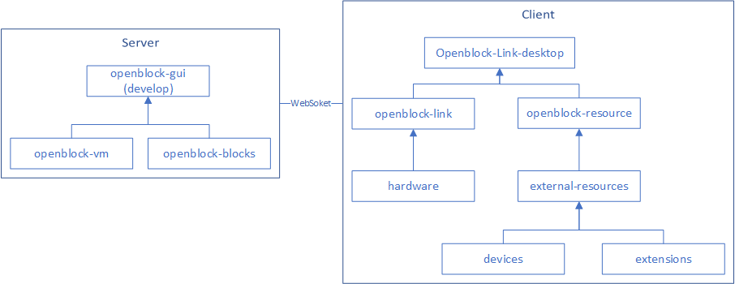

## 简介

工程整体以 Node.js 开发，其中的代码以 npm 包的方式根据功能做分割发布，并在顶层被调用封包为一个整体软件。其中核心的几个功能包为：

- openblock-gui 基于 React 的前端用户界面。
- openblock-vm 管理状态和运行后台逻辑代码，接收 GUI 的操作请求并发送状态和事件给 GUI。简要来说就是 gui 中积木块执行或是于硬件交互等功能均是由 vm 来进行实际逻辑处理和发送到接口服务器的。
- openblock-blocks 从Google [Blockly](https://developers.google.com/blockly/) 项目创建的分支。这个仓库同时处理实现积木块（blocks）的 UI 显示、逻辑功能以及代码生成功能。
- openblock-link 通过 websocket 为 openblock 提供本地硬件接口服务，与本地运行的编译软件服务。
- openblock-resource 通 过websocket 为 openblock 提供本地插件即第三方设备的内容。

而后根据软件在线版和离线版两个不同得到部署方式，他们又被不同的方式进行打包和发布。

## 离线版

在离线版的情形下，所有软件包都在 openblock-desktop 中被调用，并通过 electron 打包为一个在本地独立运行的软件。

- openblock-desktop

	核心依赖包: openblock-gui (desktop分支)，openblock-vm，openblock-blocks，openblock-link，openblock-resource

## 在线版

在线版部署方式是通过在服务器端部署 openblock-gui 内容，而后在用户端安装 openblock-link-desktop 来实现完整功能。其整体结构分为两个部分，他们之间通过 websock 来连接。

- openblock-gui (develop分支)

    核心依赖包: openblock-vm，openblock-blocks

- openblock-link-desktop

    核心依赖包: openblock-link，openblock-resource
